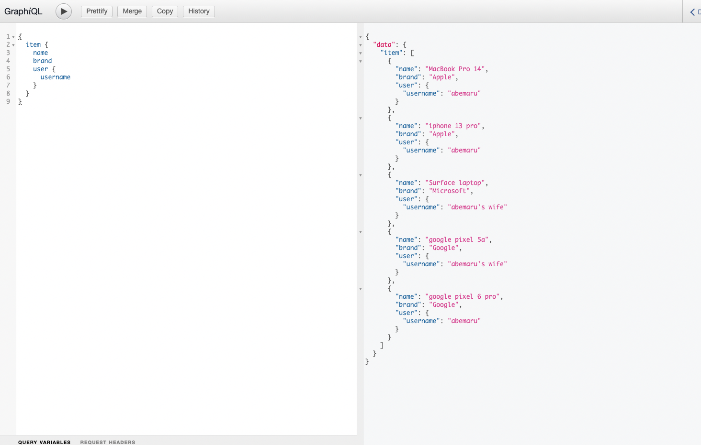

# 前提
- dockerがインストール済みである

# 起動方法
```terminal
% docker-compose -f docker-compose.yml up -d --build
```

上記コマンドを実行後、[localhost:8000/graphql](http://localhost:8000/graphql)へ接続するとGraphiQLの画面に遷移する。現状はAll()のみ実装しているので以下のように表示される。

